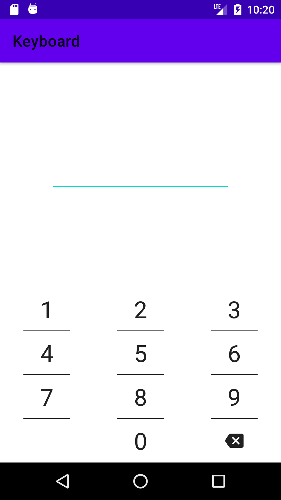
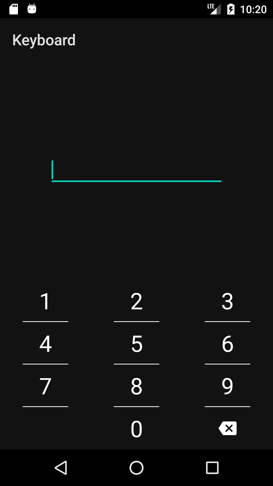

## Simple Numeric Keyboard View
[](https://bintray.com/minyushov/android/numeric-keyboard/_latestVersion)

<p>
  
  
</p>

```groovy
dependencies {
  implementation 'com.minyushov.android:numeric-keyboard:version'
}
```
